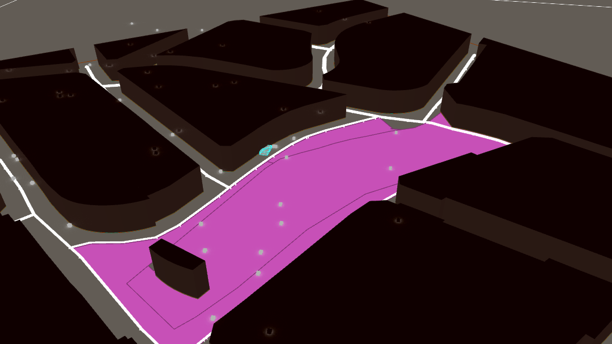
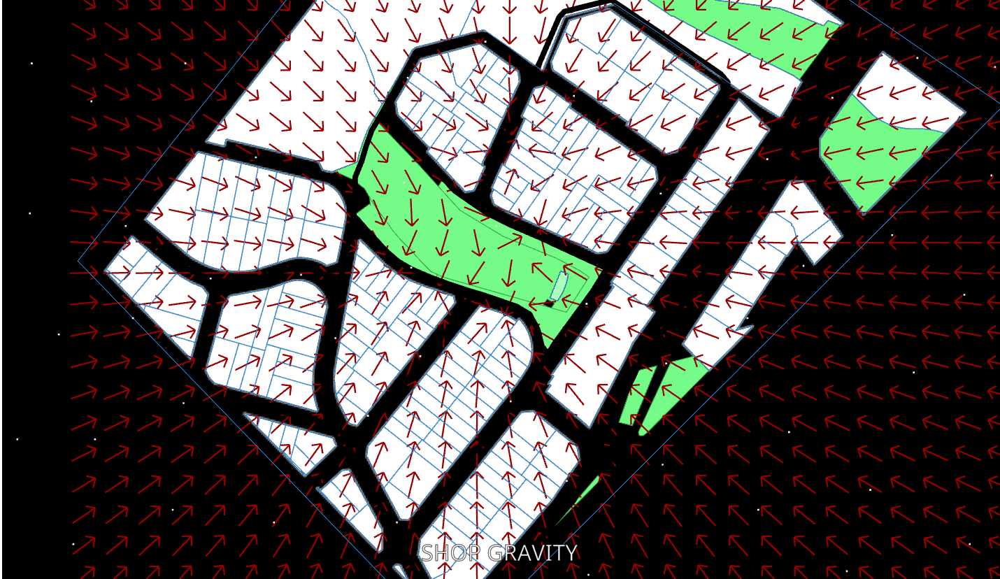
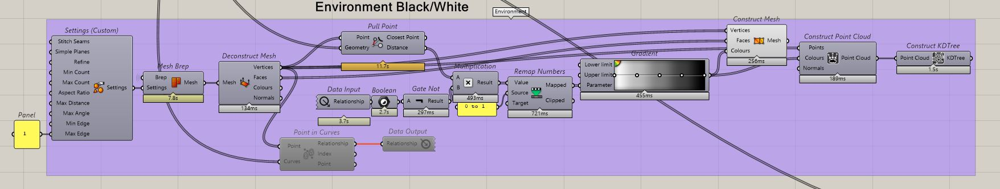
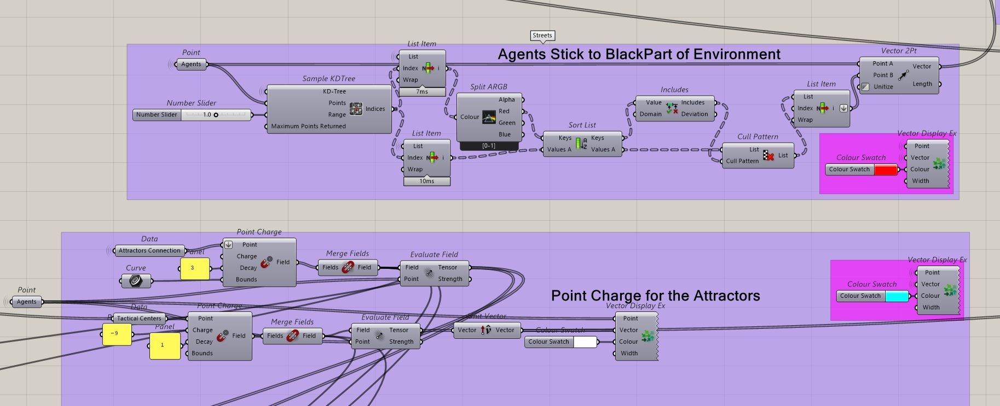
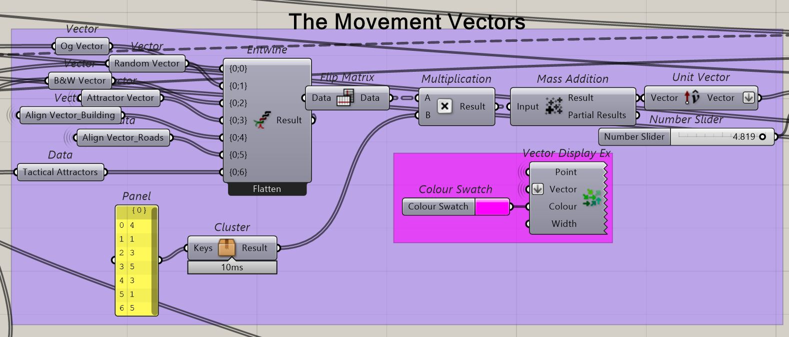

# Agent Simulation: Measuring Intervention Impact

**Author(s):** Siddharth Nambiar  
**Last modified:** March 28, 2024  
**Summary:** Visualizing an urban simulation of free-agents affected by a specific intervention

> **Note on provenance**  
> This article was originally published on IAAC’s blog as part of academic work. This version is republished here by the author for portfolio consolidation.

---

## The Objective

The objective of the project was to simulate the movement of people within a specific neighborhood in the city of **Viladecans, Spain**, and visualize the difference in the movement patterns of free agents **pre-intervention vs. post-intervention**.

---

## Why an Agent Simulation?

Agent-based simulation is effective for planning urban interventions due to its ability to model complex systems and capture emergent behavior.

### Granular Representation
Agent-based simulations model individual entities (agents) and their interactions within an environment. This granular representation allows for detailed examination of factors influencing urban dynamics, such as individual behaviors, preferences, and decision-making processes.

### Dynamic Feedback Loops
Agents in the simulation can interact with each other and their environment in dynamic ways, leading to feedback loops and emergent behavior. This allows planners to observe how interventions may propagate through the system and affect different aspects of urban life over time.

### Scenario Exploration
Agent-based simulations enable the exploration of different scenarios and interventions by adjusting parameters and rules governing agent behavior. Planners can simulate various policy options, infrastructure changes, or urban designs to assess their potential impacts on factors like traffic flow, land use patterns, or social dynamics.

### Spatial Considerations
Agents in the simulation can be spatially situated within a virtual representation of the urban environment. This allows planners to analyze spatial patterns, distribution of resources, accessibility, and the spatial diffusion of interventions across the city.

### Adaptability and Flexibility
Agent-based models can be adapted and refined as new data becomes available or as the planning process evolves. This flexibility allows planners to iteratively refine their understanding of urban systems and make informed decisions based on updated simulations.

### Risk Assessment and Uncertainty Management
Agent-based simulations facilitate the assessment of risks and uncertainties associated with interventions. Planners can explore different scenarios under varying conditions to identify potential challenges, vulnerabilities, or unintended consequences before implementation.

### Participatory Planning and Stakeholder Engagement
Agent-based simulations can also support participatory planning by helping stakeholders understand outcomes through visualization and scenario exploration—fostering dialogue, consensus-building, and more inclusive decision-making.

**Overall, agent-based simulation provides a powerful tool to understand urban complexity, explore alternative futures, and design more resilient, sustainable, and people-centered interventions.**

---

## Location

The agent simulation was designed for a **specific location in Viladecans, Spain**.

> *(Optional: Add an image/map here)*  
> ``

---

## The Forces at Play

### Setting the Environment

The agents need to be assigned movement patterns—starting with a random **X & Y vector movement**. Before defining additional forces, it’s essential to set up the environment so that agents interact correctly within the field of play.

To ensure agents **stick to streets**, a simple raster logic was used:

- **Buildings / restricted spaces:** `0` (white)  
- **Streets / walkable spaces:** `1` (black)

Using this, values can be assigned across the map so agents avoid entering zones marked `0`. This keeps movement constrained to the street network.

---

### Attractor Points and Vector Fields

Next, the vector field is driven by **attractor points** mapped across the neighborhood.

- In the first instance, different shops/buildings along the central park were used as attractors.
- You can observe field strength where vectors stop beyond a certain distance—indicating the **reach of the pull**.

In the second instance, the attraction of the **central space**—which would host the tactical urban intervention—has a stronger pull and larger reach. This encourages agents from surrounding neighborhoods to visit the area hosting the tactical center.

---

### Weighted Average of Movement

A weighted average of movement vectors is used to decide the final averaged movement of the agent within the sandbox.

---

## The Simulation in Action

The simulation suggests that people—even from other neighborhoods—visit the intervention area.

This increased footfall is reflected in:
- Higher flow through the surrounding street network
- Increased exposure to local shops and edges around the intervention zone

**Interpretation:** This indicates the potential for increased business revenue after implementing tactical centers, compared to the baseline condition.

---

## Challenges Faced

- Agents sometimes group up and get stuck in corners  
- Agents sometimes enter buildings  

---

## Next Improvements (Optional)

If you continue the project, typical fixes include:
- Collision/avoidance tuning at corners and intersections  
- Stronger boundary constraints for non-walkable cells  
- Adding navigation graphs (e.g., street network graph) instead of pure vector drift  
- Introducing agent goals (home → shop → park → home) instead of random movement
