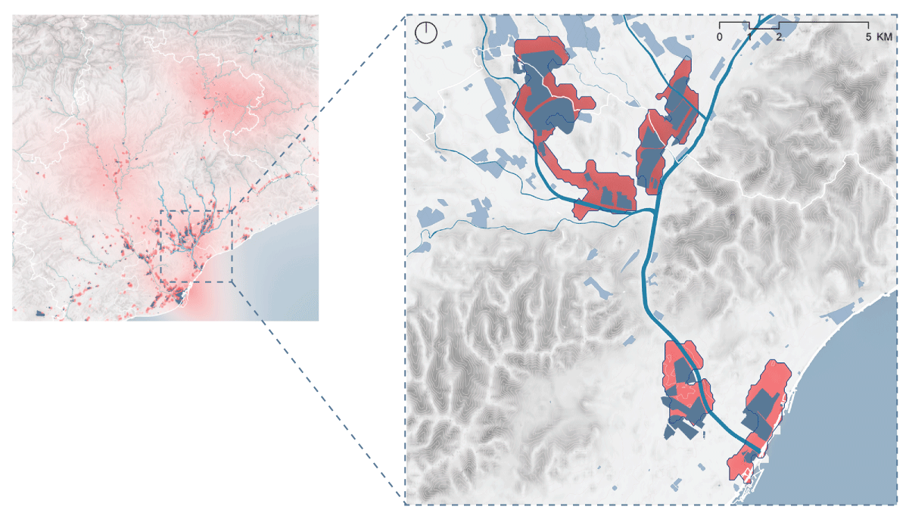
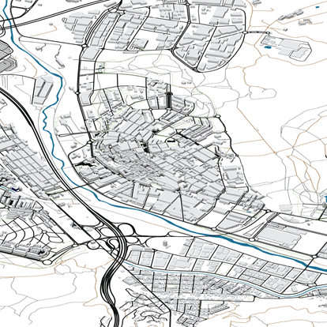
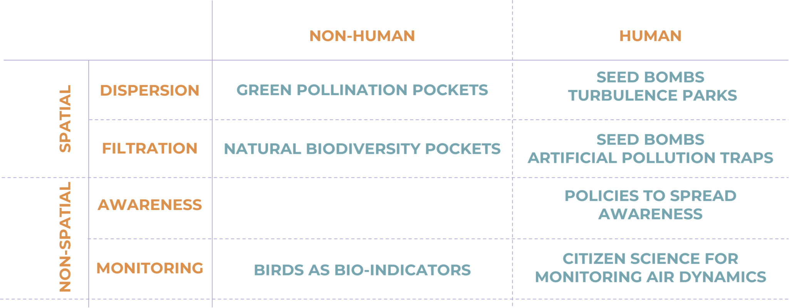
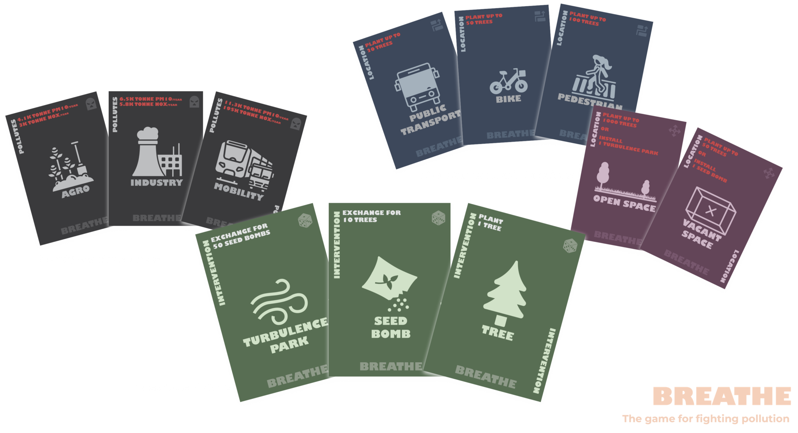

# From Pollution To Pollination

Team member(s): Juan Camilo Giraldo, Nupur Sircar and Siddharth Nambiar  

## 1. Introduction

Urban air quality is a pressing concern,  being the result of both natural elements and human-induced pollutants. The city of Barcelona grapples with local pollutants like NOx and PM10, primarily  caused by ground transport and industrial activities. While current policies focus on mobility solutions, the project questions the need for complementary approaches.

The project “From Pollution to Pollination” encompasses a detailed journey to strategize functional systems to design cleaner air while restoring ecological balance in the city of Barcelona along the basin of river Besos.

## 2. Objective

The objective of this project is to leverage air dynamism for a self-healing, regenerative cycle. Natural processes triggered by wind become a key element of the design, suggesting an ecological system as a natural air filter. This concept aims at initiating a revegetation cycle to enhance green infrastructure.

## 3. Context

Fundamentally air is composed of a variety of elements, broadly nitrogen, oxygen, argon and other elements. Diving deeper into its constituents it is noticed that levels of these elements get diluted due to the presence of various pollutants like CO2, O3, CH4, NOx, PM2.5, PM10 and many others. However, these pollutants are considered harmful at different scales. CO2, O3 are contributors of global warming that brings about macro-climatic changes. Pollutants like NOx, PM10 and PM2.5 contribute to local pollution, prolonged exposure to which affects the liveability of cities and health of its citizens.

  
*fig 3.1. Different plans developed focus on reduction in emissions of NOx and PM10 from different modes of transport*

To study Barcelona as one of the major cities which is highly affected by the presence of local pollutants in air, it is vital to concentrate on the policies. Barcelona has actively been strategizing over the past two decades to mitigate air pollution by 2050. In doing so, the policies focus more on the local pollutants like NOx and PM10 and what measures can be taken to significantly reduce the concentration levels of these pollutants. Analyzing the sources of these two pollutants it is observed that ground transport and port and airport activities contribute for up to 70% of these emissions. Hence, Barcelona’s policies are targeted towards mitigating air pollution through mobility-oriented solutions. The Metropolitan Plan of urban mobility of Barcelona 2024 prioritizes sustainable transport corridor along with schemes to reduce the usage of private motorized vehicles.

With all the measures Barcelona has been taking for transportation, it compels designers to look deeper through the magnifying glass, at the additional sources of these pollutants in air. As a result, the biggest polluters, after transport activities, are industrial activities and energy generation with almost 24% contribution of NOx and 21% of PM10 contribution. So this deepens the design question furthermore and forces designers to reflect on *“Is there another way to tackle air pollution that complements the existing mobility plans?”*

## 4. Analysis

Designing for cleaner air requires an understanding of the quality of air. In this regard, observations from the changing patterns in concentration of NOx and PM10 in air within the province of Catalonia bring to light specific locations, most of which lie in the basin of Besos and the Urban Barcelona.

<video controls style="width:100%;max-width:900px;border-radius:10px;border:1px solid #eee" src="../assets/Pollution2Pollination/MonthlyAnimationCropped.mp4"></video>

<em>(fig 4.1(a)NOx Monthly Average Concentration; (b) PM10 Monthly Average Concentration; (c) Monthly Average Wind Speed and Direction)</em>

However, the changing patterns of concentration of pollutants also emphasize on an underlying cause, i.e. movement pattern of air. Air is dynamic and with its changing speed creates wind. Across the year the changing wind speeds assist carrying pollutants from the source to the rest of the city.

On superimposing layers of pollutant concentration along with the sources on the ground, a correlation is established between the industrial activities and the concentration levels.

Studying the different layers and their adjacencies helped to zoom into the major areas that were the sources of these pollutants in the air. These are precisely the stretches which can be the initiation points to strategize and design for cleaner air in Barcelona.

  

## 5. Conceptualisation

Dynamic wind flows play into certain factors that allow for the development of a ‘self-healing’/regenerative cycle. The regenerative cycle helps to bridge the gap between turbulent wind speed and vegetation by the process of pollination. Pollen is distributed across distance through different means. Conversely turbulent wind speeds generate the phenomena of pollination to help in revegetation.

  
*(fig 5.1. cycle of re-vegetation)*

Wind pollination also known as anemophily is a form a pollination in which pollen grains are transported by wind to the stigmas of other flowers. It is the most common form of pollination, accounting for over 70% of all plant species. Wind pollinated plants typically produce large amounts of pollen that is lightweight and easily carried by the wind. They have stigmas that are large and feathery, which help them to capture pollen grains.

## 6. Design Materialisation

The design ideology of this project revolves around designing an ecological system that can gratify a filter for pollutants in air. The concept is to generate a system of greens, by connecting green nodes through green corridors which respond to turbulent winds in order to foster pollination. This in turn starts a cycle of revegetation that provides a natural filter for pollutants in air.

In order to identify potential stretches of green corridors, the prioritized mobility corridors stated by the municipality are the stretches of opportunity to link up ecological corridors that mitigate emissions from non-mobility stakeholders. The mobility prioritized corridors include, bus segregated lanes, new tram and rail lines, metropolitan bike axes and corridors for enhancing pedestrian experience. Nonetheless, while identifying potential pockets of green nodes, open green spaces and vacant spaces serve as pockets of opportunity to foster pollination pockets and pollination booster space, respectively. Highlighted open spaces in close proximity to the categorized mobility, along with vacant spaces like unused industries and plots are sites that can act as a spur in the process of revegetation through pollination.

This also correlated with sites/nodes within close proximity of these expansion corridors where interventions could be further incorporated to advance the agenda of making the air cleaner and greener.

  
*(fig 6.1. Filtering the prioritised mobility corridors and proximal nodes)*

## 6.1 Design Locations

Realigning the projects towards the local scale into the identified sites, looking at specific intervention for nodes and connecting corridors, becomes imperative. These sites are strategically located along the basin of river Besos, giving designers the opportunity to highlight different typologies of nodes based upon the interventions implemented.

Tres Xemenies sector had unused brownfield plots.

The El Bon Pastor Polygon had open green spaces located solely along the small residential pocket, however the sector already has plans for unused derelict industrial buildings and spaces for the development of mixed-use use cases. One example would be the reuse of the old Mercedes Benz factory that has been taken up by Conren Tamway Developers to perform an adaptive reuse use case for the factory and its adjacent surroundings.

Further north up the river Besos we have Ripollet and La Llagosta, which are both industrial corridors. La Llagosta doesn’t have too many green spaces however the availability of vacant land within close proximity to one another allows for the grouping of interventions to be made. Ripollet has a lot of green spaces within close proximity to the industrial zone, and a large space of vacant land along the spine of the river tributary.

The stretch along Ripollet is a sample that depicts the possible outcome if the design concept was to move forward in implementation. The growth of green spaces along the proposed sites of intervention correlates with the existing urban infrastructure to create a hyper-connected green corridor in the district. This goes towards facilitating the improvement in air quality of these spaces while reducing concentration levels of PM10 and NO2 in the atmosphere.

  
*(fig 6.1.1. An overview of implementation of design concept in the site of Ripollet)*

## 6.2. Key Framework

  
*subtext under image (fig 6.2.1. Decision tree to prioritize spaces to plug in the design)*

The analysis and strategies feature key concepts to construct a design matrix, taking into consideration non-human and human counterparts of the city and spreading the matrix across the spatial and non-spatial realm to design for turbulence which in turn would be designing for pollination and the expansion of greens.

  
*(fig 6.2.2. Design matrix considering the stakeholders along two major realms)*

## 6.3. Spatial Interventions

At the inception of spatial design intervention, the strategies revolve around theoretically revisiting the identified locations to study the species of trees existing along the basin of river Besos. This helps the designer to sieve out the required tree species that pollinate through wind and resonant turbulence. This gives the designer a palette to choose from while designing the green nodes and the connecting green corridors.

The design proposal focuses on ways to plug-in the system of greens along with the mobility prioritized corridor as a policy to create interconnected ecological corridors. Selection of tree species in the palette depend on the type of mobility corridor the ecological corridors plug-in with. Selection of low to high canopy tree species differ from pedestrian corridors to tram lines.

  
*(fig 6.3.1. Different ecological corridor sections for different mobility corridor and ecological node sections for open and vacant spaces)*

However, in the nodes identified in close proximity to these corridors, open spaces can house biodiversity green pockets. These biodiversity pockets have a variety of tree species from the wind-pollinating tree palette as well as trees that can attract other ecological counterparts like birds and other insects. These are also sites for roosting for birds, that will bring an ecological balance at the nodes of the intervention.

Other identified vacant spaces vary from unused built spaces to unused open spaces. These spaces are the nodes of artificial interventions like seed bombs and turbulence parks. A seed bomb is a manual method of dispersing pollen in the air to speed up the process of pollination. This can vary from refurbishing unused buildings to use them as means to disperse pollen to re-vegetate or a manually spreading clustered balls of seeds across an area.

Turbulence parks are designated spaces where winds speeds are intentionally manipulated to create harmonic and resonant turbulence which can help enhance wind pollination in the surrounding area. This intervention typology involves the use of vacant open linear space. It is a relatively new concept yet has been studied upon and implement in some cases in different parts of the world. The solution proposes enhancing pollination by creating structural installations placed within close proximity of green spaces to as to intercept incident wind on its surfaces and result in the creation of harmonic wind currents that are resonant with the surrounding vegetation and would facilitate the increase of pollination by wind. Resonant wind currents have been shown to increase pollination and increase seed dispersal distance by upto 50% in some plants.

## 6.4. Non-Spatial Interventions

The Non Spatial methods for enhancing the quality of the air involves strategies revolving around  

Awareness

Monitoring

Initiatives to spread awareness would include policies that focus primarily on the human counterpart of the city. The intention is to make the problems of air tangible and make the problems, stakeholders of air and the proposed solution, visible to all. Effortless games that talk about the effects of using different ecological design solutions around different sources of pollution, will increase the level of awareness in younger generations, the future changemakers.

  
*(fig 6.4.1. BREATHE: A game for all age groups to spread awareness about air pollution)*

This would be in the interest of instigating positive behavioural changes in the public. This knowledge can lead to changes in reducing personal emissions, choosing cleaner transportation options and adopting practice that minimize pollution.

Initiatives to monitor constant changes in pollutant concentration levels could include the use of birds as bio indicators looking at nesting and migration pattern to correlate healthier air conditions. Artificial ways of monitoring could include the use of Citizen science kits. By providing citizen with tools to monitor air dynamics, the idea is to complement existing monitoring stations.

  
*(fig 6.4.2. Changing numbers of monitoring stations and birding hotspots to monitor air quality through both human and non-human stakeholders)*

## . Impact and Conclusion

In conclusion, the design upsurges the numbers of high canopy trees which directly increases land roughness to foster more turbulence. With turbulent winds the likelihood of pollination increases by 50% which makes the process of revegetation swifter. Correspondingly it also increases the quantity of green filters for pollutants in the air. Putting into place the pollinating green corridors along with the green nodes creates a hyper-connected ecological corridor.

The impact of this design proposal depends not just on the spatial strategies but also on the success rate of the non-spatial strategies.

  
*(fig 7.1. Statistics understanding the exponential impact of the design solution)*

Statistically 1 full grown tree absorbs 197 g/yr of PM10 and 502 g/yr pf NOx. Through the spatial design strategies, the design aims at creating 73.9kms of ecological corridors, 3.3sq.kms of ecological nodes and 1.9sq.kms of re-furbished vacant spaces. This implies that the effectiveness of the project depend on how many trees are planted in these calculated areas. Planting 1 tree per km of the designed space can reduce upto 0.002% of generated emissions in Barcelona in one year. With increased awareness amongst human counterparts, the planting scheme can be expanded to planting more than 500 trees per km of the designed space to reduce generated emissions in Barcelona by 4.2% /yr.  

As a final point, it is highly important to take into consideration all the human and non-human counterparts along both spatial and non-spatial realm for a successful execution of this project and observe significant changes in pollution levels, while restoring an ecological balance in Barcelona.

  
*(fig 7.2. Designed wind speeds result in re-vegetation through increased wind pollination)*
